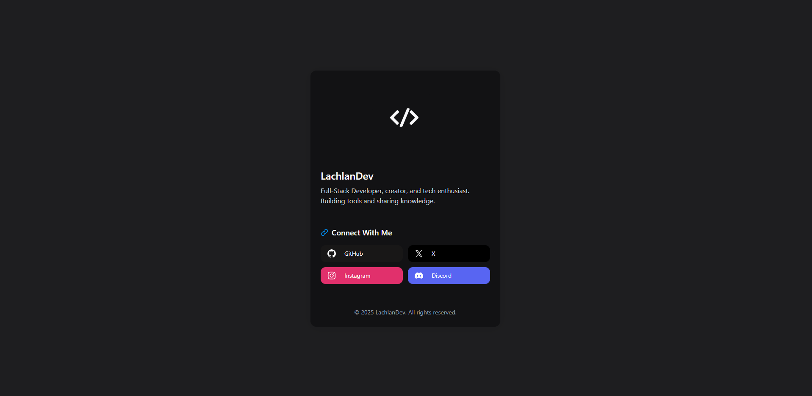

---

## 🔗 Live Demo

Visit the live site: [https://lachdev.com](https://lachdev.com)

## 💡 Features

* **Profile Card** with avatar, bio, and social links (GitHub, X, Instagram, Discord)
* **Responsive Design** built with HeroUI (React) and Tailwind CSS
* **Dark Mode** aesthetic with high contrast and smooth animations
* **SEO‑friendly** meta tags, Open Graph, and Twitter Card support
* **Static Export** via Vite for lightning‑fast performance

## 🛠 Tech Stack

* **Framework:** React with Vite
* **UI Library:** @heroui/react, Tailwind CSS, Framer Motion
* **Icons:** Iconify (akar-icons fill set)
* **Deployment:** Static site (Netlify / Vercel / Nginx)

## 🚀 Getting Started

1. **Clone the repo**

   ```bash
   git clone https://github.com/lachlandev/lachlandev-website
   cd src
   ```
2. **Install dependencies**

   ```bash
   npm install
   ```
3. **Run in development**

   ```bash
   npm run dev
   ```
4. **Build for production**

   ```bash
   npm run build
   ```
5. **Preview the build** (locally)

   ```bash
   npm run preview
   ```

After building, your static files will be in the `dist/` directory, ready to deploy.

## 🤝 Contributing

1. Fork this repository
2. Create a branch
3. Commit your changes
4. Push to the branch 
5. Open a Pull Request

Please ensure all lint checks pass and provide clear commit messages.

## 📄 License

This project is licensed under the [MIT License](./LICENSE).
